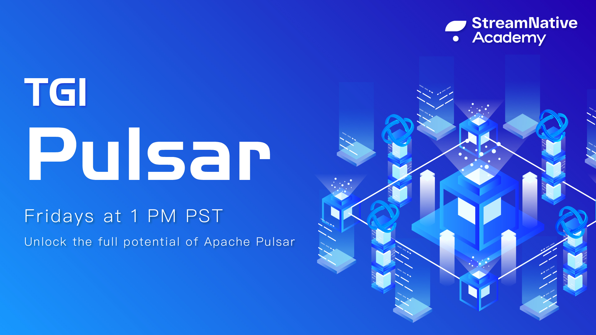

This is the official repository for TGI Pulsar (TGIP).

## Playlist

- [015: What's New In Pulsar 2.6.0?](https://github.com/streamnative/tgip/blob/master/episodes/015/README.md)
- [014: Pulsar Schema and Flink Integration](https://github.com/streamnative/tgip/blob/master/episodes/014/README.md)
- [013: Pulsar Schema and Presto SQL](https://github.com/streamnative/tgip/blob/master/episodes/013/README.md)
- [012: Introduction of Pulsar Schema](https://github.com/streamnative/tgip/blob/master/episodes/012/README.md)
- [011: BookKeeper AutoRecovery](https://github.com/streamnative/tgip/blob/master/episodes/011/README.md)
- [010: BookKeeper LAC protocol](https://github.com/streamnative/tgip/blob/master/episodes/010/README.md)
- [009: Introduction of Apache BookKeeper](https://github.com/streamnative/tgip/blob/master/episodes/009/README.md)
- [008: What is new in Pulsar 2.5.1?](https://github.com/streamnative/tgip/blob/master/episodes/008/README.md)
- [007: Cluster & Geo-replication](https://github.com/streamnative/tgip/blob/master/episodes/007/README.md)
- [006: Lifecycle of a Pulsar message](https://github.com/streamnative/tgip/blob/master/episodes/006/README.md)
- [005: Taking a deep-dive into Apache Pulsar architecture for performance tuning](https://github.com/streamnative/tgip/blob/master/episodes/005/README.md)
- [004: Deep dive into authentication and authorization](https://github.com/streamnative/tgip/blob/master/episodes/004/README.md)
- [003: Secure a Pulsar cluster with TLS](https://github.com/streamnative/tgip/blob/master/episodes/003/README.md)
- [002: Kubernetes Deployment](https://github.com/streamnative/tgip/blob/master/episodes/002/README.md)
- [001: Install a Pulsar cluster](https://github.com/streamnative/tgip/blob/master/episodes/001/README.md)

## Basic information

TGIP, organized by StreamNative, is a weekly live video streaming about Apache Pulsar and its ecosystem.

* Time: every Friday at 1PM PST.

* [Live streaming link](https://www.youtube.com/channel/UCywxUI5HlIyc0VEKYR4X9Pg/live): you can watch the Pulsar live streaming here. 

* [List of episode](playlist.md): contains a list of all episodes.

* [Recorded video link](https://www.youtube.com/channel/UCywxUI5HlIyc0VEKYR4X9Pg?view_as=subscriber): we record every live streaming and upload them here.

## Start an episode

[Open an `episode` issue](https://github.com/streamnative/tgip/issues/new/choose) and follow the detailed workflow.

## Suggest an episode 

If you have any ideas for TGIP, welcome to [open an `episode-idea` issue](https://github.com/streamnative/tgip/issues/new/choose).

We will choose the topic that is appropriate and fits with what's happening in the Pulsar community and industry.

