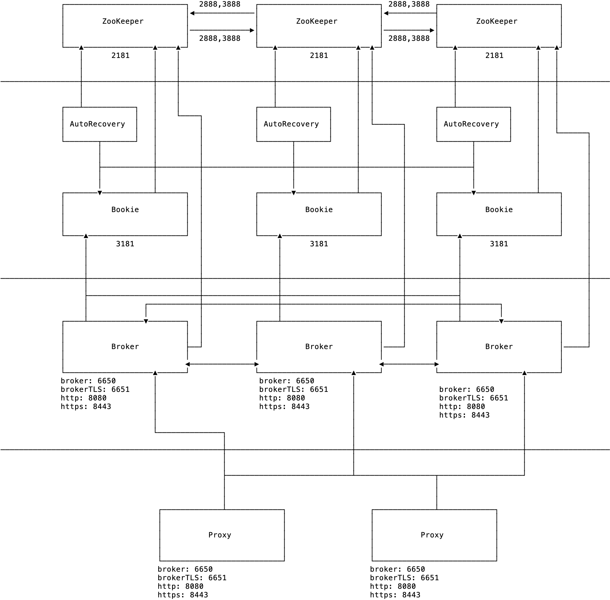

# Basic information

- Topic: Install a Pulsar cluster

- Host: Sijie Guo [@sijieg](https://twitter.com/sijieg)

- Date: 03/13/2020

- Time: 1PM PST

- Duration: 1hr

- Recorded video link: https://www.youtube.com/watch?v=1RQSot5tTuU&list=PLqRma1oIkcWhWAhKgImEeRiQi5vMlqTc-

## Note

- Pulsar Network Topology

- [Demo instructions](demo.md)

